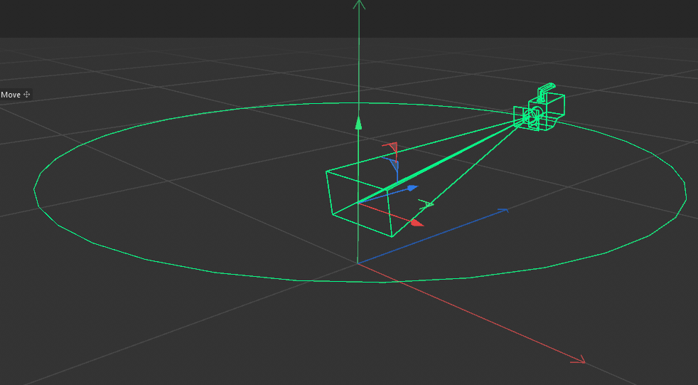
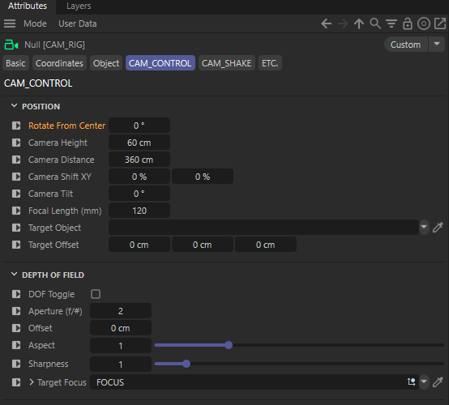
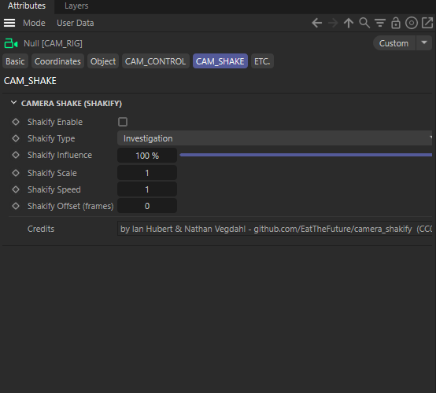

# CAM_RIG

An orbit camera rig for Cinema 4D (Redshift) driven from one control null.

## Controls

| CAMERA CONTROL | CAMERA SHAKE |
|---|---|
|  |  |

## Credits

Shake data from **Camera Shakify** by Ian Hubert & Nathan Vegdahl, [CC0](https://creativecommons.org/publicdomain/zero/1.0/).

## Requirements

Cinema 4D 2026 · Redshift (RS Camera).
