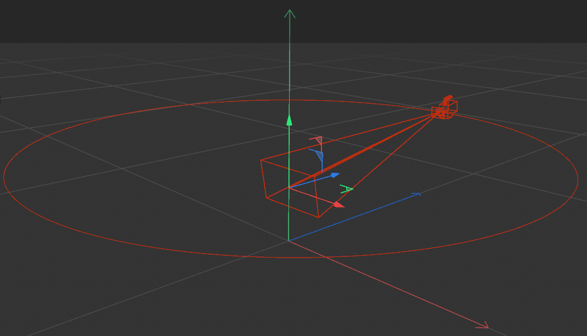
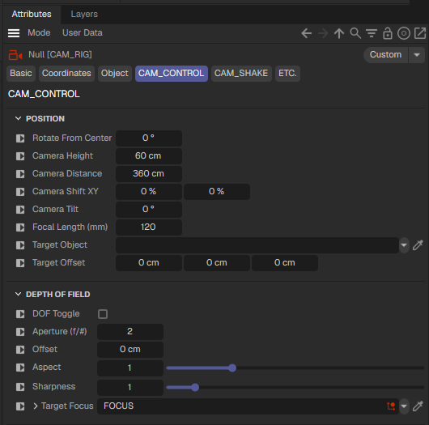
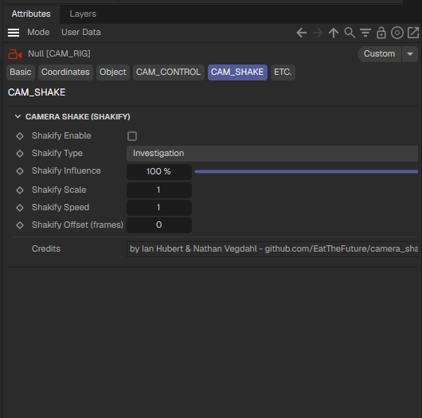
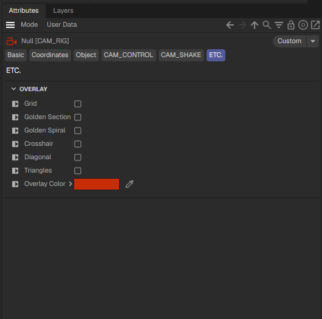

# CAM_RIG

An orbit camera rig for Cinema 4D (Redshift) driven from one control null.

## Controls

| CAMERA CONTROL | CAMERA SHAKE | ETC. |
|---|---|---|
|  |  |  |

## Credits

Shake data from **Camera Shakify** by Ian Hubert & Nathan Vegdahl.
[https://github.com/EatTheFuture/camera_shakify
](https://github.com/EatTheFuture/camera_shakify)
